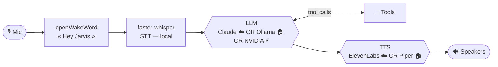

# 🤖 Jarvis — local-first voice assistant

*[Version française](README.md)*


A French-speaking voice assistant that runs **on your own machine**. Say *"Hey Jarvis"*,
speak naturally, and it reasons with an LLM, uses a growing toolbox (smart home, PC,
web, phone…), and answers out loud. It supports **cloud mode** (Claude + ElevenLabs),
**local mode** (Ollama + Piper), or **NVIDIA mode** (NVIDIA NIM + local/cloud TTS).

> Personal project shared as-is. Targets **Windows 11**, needs a microphone. Most integrations are optional and disable themselves cleanly when unconfigured.

## ✨ Features

- 🎙️ **Voice-first** — wake word (openWakeWord), local transcription (Whisper), spoken replies
- 👁️ **Screen vision** — "what's this error?", "read this", "translate that" (screenshot → compatible LLM)
- 💡 **Smart home** — Philips Hue (on/off, brightness, color), light scenes & moods
- 🎬 **Streaming** — OBS control (stream, record, scenes, replay buffer)
- 🖥️ **PC control** — launch apps, media/volume, live GPU/CPU/RAM stats
- 📅 **Calendar** — Google Calendar across all your calendars, create/delete with confirmation
- 📧 **Email** — Gmail summaries and drafting
- 💬 **Discord** — mentions + daily channel digest
- 📸 **Instagram** — followers & video views vs. yesterday
- 🍽️ **Web reservations** — browser automation via Playwright
- 🌐 **Browser assistant** — summarize/translate the active tab and act on pages
- 📞 **Phone calls** — Twilio
- 🧠 **Long-term memory** — preferences, people, projects
- 🎭 **Personalities** — sarcastic butler, neutral, concise
- 🏠 **Presence** — phone ping + scenes
- 🌤️ **Utilities** — weather, timers, time/date
- 🔌 **MCP server** — exposes home/PC tools to MCP clients

## 🏗️ Architecture



## ☁️ Cloud vs 🏠 Local vs ⚡ NVIDIA

| | **cloud** | **local** | **nvidia** |
|---|---|---|---|
| LLM | Claude (Anthropic API) | Ollama (`qwen3.5:4b`…) | NVIDIA NIM (`openai/gpt-oss-120b` by default) |
| Voice | ElevenLabs | Piper | Piper or ElevenLabs |
| Transcription | faster-whisper | faster-whisper | faster-whisper |
| Tools | ✅ | ✅ | ✅ |
| Cost | pay-per-use | free | depends on NVIDIA quota |
| Privacy | API calls | **nothing leaves the machine** | NVIDIA API calls |

Switch with one line: `mode: cloud`, `mode: local`, or `mode: nvidia`.

The NVIDIA provider uses NVIDIA's OpenAI-compatible API. The default model is
`openai/gpt-oss-120b`; the model can be changed through `nvidia.modele` without changing code.
The optional `reasoning_effort` parameter is left empty by default for maximum compatibility
with the public NVIDIA endpoint.

Keep the API key in the environment:

```powershell
$env:NVIDIA_API_KEY = "your_NVIDIA_key"
```

## 🚀 Quick start

Requirements: **Python 3.13**, [uv](https://docs.astral.sh/uv/), Windows 11, a mic.

```bash
uv sync
uv run playwright install chromium
copy config.example.yaml config.yaml
```

Configure NVIDIA mode if desired:

```yaml
mode: nvidia
nvidia:
  modele: "openai/gpt-oss-120b"
```

Then test it:

```powershell
$env:NVIDIA_API_KEY = "your_NVIDIA_key"
uv run python scripts/test_nvidia.py
```

The smoke test checks text generation and tool calling without executing any real Jarvis tool.

To launch Jarvis:

```bash
uv run python jarvis14.py
```

Say **"Hey Jarvis"**.

## ⚙️ Configuration

Everything lives in the untracked `config.yaml` (copy from `config.example.yaml`).
See the integration guides in `docs/` for the rest of the system.

## 🛡️ Ethics & Safety

Trust is built in, not bolted on:

- Voice confirmation before every irreversible action.
- Phone calls announce themselves honestly and never impersonate humans.
- Never enters passwords or payment details, and never auto-pays.
- Protected banking/tax/health domains are read-only.
- Secrets and personal data are never committed.

## 🗺️ Roadmap

- [ ] Godox video-light control
- [ ] Notes & reminders tools
- [ ] Sentence-by-sentence streaming TTS
- [ ] 100% local browser loop
- [ ] Automatic Instagram token refresh
- [ ] Tony multi-agent architecture: Elio (code), Lavanda (web), Clover (files)

## 🤝 Contributing

Adding a tool is a single file in `tools/` with an `@outil(...)` decorator — it's
auto-discovered, no wiring needed.

## 📄 License

MIT — see [LICENSE](LICENSE).
